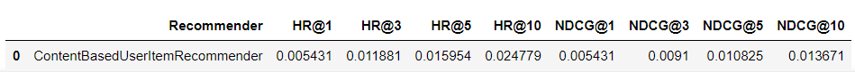
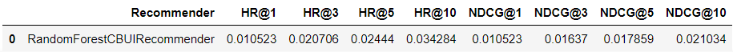
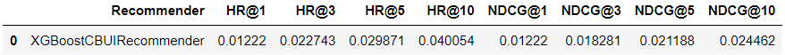
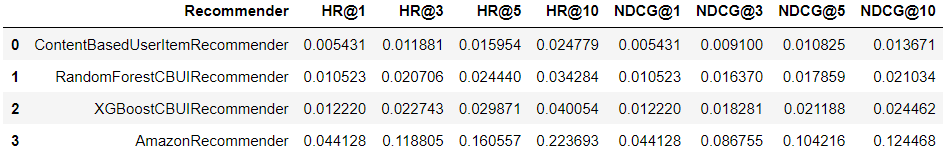

# Recommenders_Project1
## Table of contents
* [Project description](#project-description)
* [Preparing the project](#Preparing-the-project)
* [Installing requirements](#Installing-requirements)
* [HTML files](#HTML-files)
* [Results](#Results)

## Project description
The goal of the project was to achieve the best HR@10 score of recommender in the final evaluation.
I've got no idea why this README doesn't look like i would like. It's almost 11pm,
I don't want to spend more time on this, so please be understanding.


## Preparing the project
You need:
* Python 3.7.9 or higher (in fact i used Python 3.9, and i, nomen omen, recommend it)
* Istall all requirements from requirements.txt


##Installing requirements
* With using Pip
```
pip install -r requirements.txt
```

*With using conda
```
conda install --file requirements.txt
```


##HTML files
HTML versions of Jupyter Notebooks are available in html directory


##Results
*Linear results:
<kbd></kbd>

*Random forest results:
<kbd></kbd>

*XGBoost results:
<kbd></kbd>

*Final results:
<kbd></kbd>
